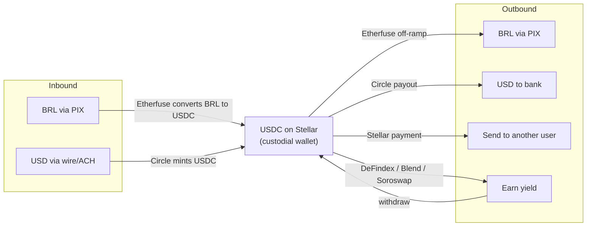
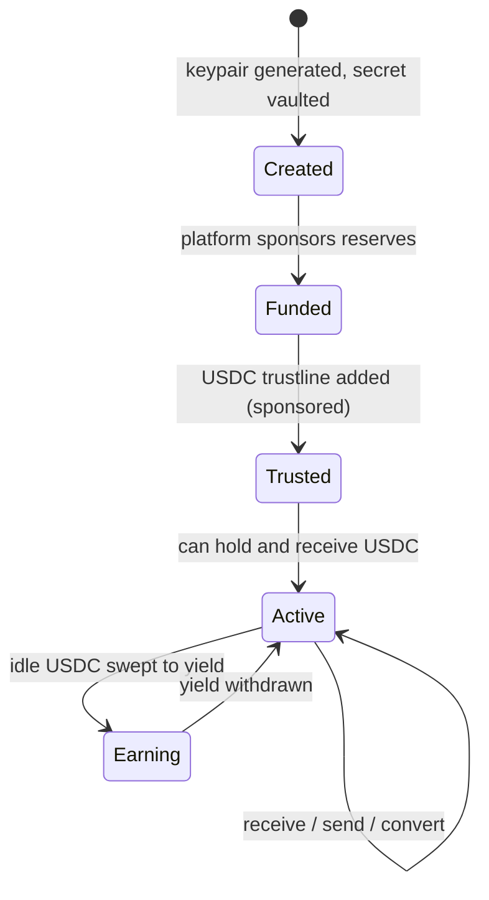
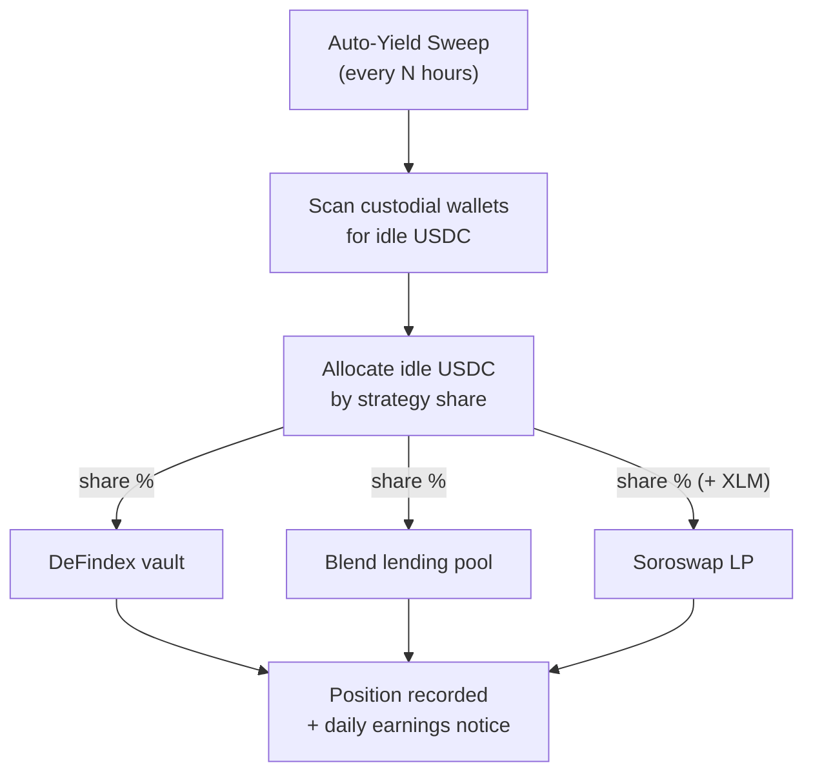
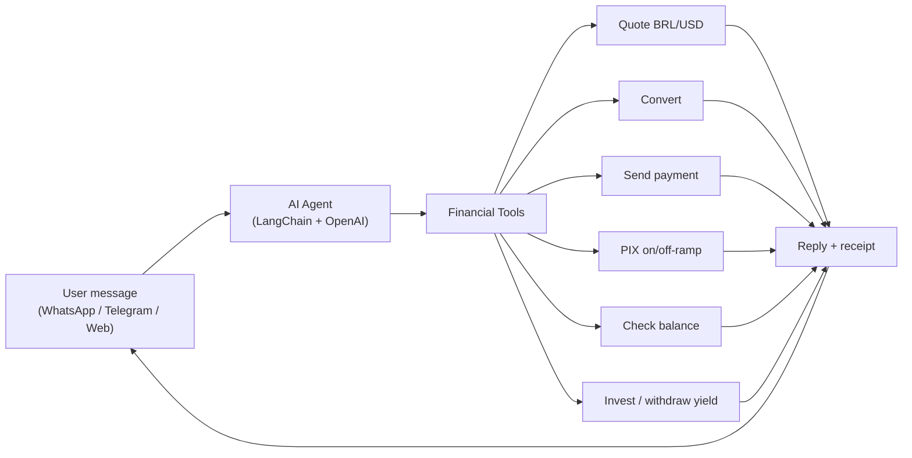

# TalkToStellar — Whole-System Architecture

End-to-end architecture of the entire platform: conversational surfaces, the
AI agent, every money movement rail (PIX, USD, on-chain), custodial wallets,
and automated yield. These are system-wide diagrams, not deliverable-specific.

Providers shown are the real integrations: **Etherfuse** (PIX), **Circle**
(USD), **Stellar** (settlement), and **DeFindex / Blend / Soroswap** (yield).

Rendered PNGs:

- [System components](./diagrams/01-system-components.png)
- [Money flows](./diagrams/02-money-flows.png)
- [Custodial wallet lifecycle](./diagrams/03-wallet-lifecycle.png)
- [Automated yield](./diagrams/04-auto-yield.png)
- [Conversational agent](./diagrams/05-agent.png)

---

## 1. System Components

How the whole platform fits together — from chat surfaces down to providers.

```mermaid
flowchart TB
    subgraph Surfaces["User Surfaces"]
        WA["WhatsApp"]
        TG["Telegram"]
        WEB["Web App (Next.js)"]
        OPS["Ops & Admin Console"]
    end

    subgraph API["Backend API (Express)"]
        AGENT["Agent API (AI)"]
        FIN["Financial API (send, convert)"]
        RAMP["Ramp API (PIX on/off)"]
        USD["USD Deposit API (wire/ACH)"]
        YIELD["Yield API (earn)"]
        QUOTES["Quotes API"]
        AUTHAPI["Auth & Security API"]
        WH["Webhooks API"]
    end

    subgraph Services["Business Services"]
        ANCHOR["AnchorService — PIX"]
        STELLAR["StellarService — pathfinding, XDR"]
        QUOTE["QuoteService — BRL/USDC"]
        FEE["FeeService — platform spread"]
        PAYOUT["PayoutService — USD payout"]
        WALLET["WalletService — custodial keys"]
        YIELDSVC["YieldService — vaults & pools"]
        RECEIPT["ReceiptService"]
        NOTIFY["NotificationService"]
    end

    subgraph Providers["External Providers"]
        ETHER["Etherfuse — PIX rails"]
        CIRCLE["Circle — USD mint/payout"]
        HORIZON["Stellar Horizon"]
        DEFINDEX["DeFindex — vaults"]
        BLEND["Blend — lending"]
        SOROSWAP["Soroswap — AMM/LP"]
        OPENAI["OpenAI — LLM"]
        EVO["Evolution — WhatsApp gateway"]
    end

    subgraph Data["Persistence"]
        PG["Supabase PostgreSQL"]
        VAULT["Secret Vault — wallet keys"]
    end

    WA --> EVO --> AGENT
    TG --> AGENT
    WEB --> AGENT
    WEB --> FIN
    WEB --> RAMP
    WEB --> USD
    WEB --> YIELD
    OPS --> AUTHAPI

    AGENT --> FIN
    AGENT --> RAMP
    AGENT --> QUOTES

    FIN --> STELLAR
    FIN --> QUOTE
    FIN --> FEE
    RAMP --> ANCHOR
    USD --> PAYOUT
    USD --> WALLET
    YIELD --> YIELDSVC
    QUOTES --> QUOTE
    WH --> ANCHOR
    WH --> PAYOUT

    ANCHOR --> ETHER
    PAYOUT --> CIRCLE
    STELLAR --> HORIZON
    QUOTE --> HORIZON
    WALLET --> VAULT
    WALLET --> HORIZON
    YIELDSVC --> DEFINDEX
    YIELDSVC --> BLEND
    YIELDSVC --> SOROSWAP
    AGENT --> OPENAI
    NOTIFY --> EVO

    FIN --> PG
    RAMP --> PG
    USD --> PG
    YIELD --> PG
    PAYOUT --> PG
```

## 2. Money Flows

Every value path the platform moves money along, all routed through USDC on
Stellar as the settlement layer.

## 3. Custodial Wallet Lifecycle

Each user gets a Stellar wallet whose key is held in the secret vault. The
platform sponsors reserves so the user never needs XLM.

## 4. Automated Yield

Idle USDC across all custodial wallets is periodically swept into yield
protocols, split by configured allocation.

## 5. Conversational Agent

The agent turns natural-language chat into financial actions through tools.

---

## Code Map

| Layer | Where |
|---|---|
| Surfaces | `frontend/`, `backend/src/api/controllers/evolution.controller.ts`, `telegram/` |
| Agent | `backend/src/api/agent/` |
| PIX (Etherfuse) | `backend/src/api/services/anchor.service.ts`, `backend/src/integrations/.../etherfuse/` |
| USD payout (Circle) | `backend/src/api/services/usd-payout-adapters.ts` |
| Stellar | `backend/src/api/services/stellar.service.ts`, `backend/src/config/stellar.ts` |
| Custodial wallets | `backend/src/api/repository/core/wallet.repository.ts`, `backend/src/api/services/core/vault.service.ts` |
| Yield | `backend/src/api/services/defindex-yield.service.ts`, `backend/src/integrations/{auto-yield,soroswap,aquarius}/` |
| Quotes & fees | `backend/src/api/services/brl-usd-quote.service.ts`, `platform-fee.service.ts` |
| Persistence | `backend/src/api/repository/`, `backend/migrations/` |
