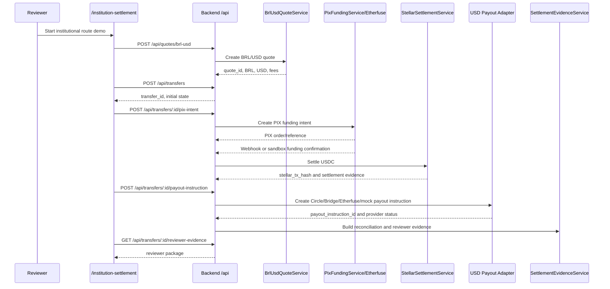
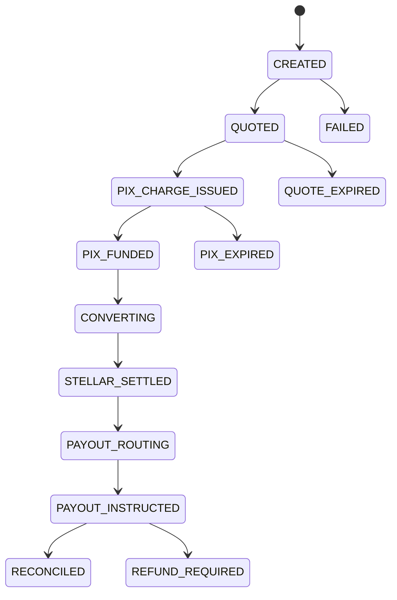

# Institutional Settlement Architecture Diagrams

These diagrams describe the current reviewer flow. They are documentation diagrams; the source of truth remains the code paths named under each diagram.

## End-To-End Flow



Code references:

- `frontend/app/institution-settlement/page.tsx`
- `frontend/app/international-transfer/use-settlement-console.ts`
- `backend/src/api/routes/quotes.router.ts`
- `backend/src/api/routes/international-transfers.router.ts`
- `backend/src/api/services/international-transfer.service.ts`
- `backend/src/api/services/settlement-evidence.service.ts`

## Service Map

```mermaid
flowchart LR
    UI[Institution Settlement UI] --> QAPI[POST /api/quotes/brl-usd]
    UI --> TAPI[/api/transfers routes]
    QAPI --> Quote[BrlUsdQuoteService]
    TAPI --> ITS[InternationalTransferService]
    ITS --> Pix[PixFundingService]
    Pix --> Etherfuse[Etherfuse PIX sandbox/API]
    ITS --> Stellar[StellarSettlementService]
    Stellar --> StellarSvc[StellarService]
    StellarSvc --> Horizon[Stellar Horizon]
    ITS --> Adapter[USD Payout Adapter]
    Adapter --> Circle[Circle Mint payout API]
    Adapter --> Bridge[Bridge compatibility path]
    Adapter --> Mock[Ops mock path]
    ITS --> Evidence[SettlementEvidenceService]
    Evidence --> Reviewer[Reviewer evidence JSON]
    ITS --> Orchestrator[TransferOrchestrator]
    Orchestrator --> Ops[/ops dashboard]
```

Code references:

- `backend/src/api/services/brl-usd-quote.service.ts`
- `backend/src/api/services/pix-funding.service.ts`
- `backend/src/api/services/stellar-settlement.service.ts`
- `backend/src/api/services/usd-payout-adapters.ts`
- `backend/src/orchestration/TransferOrchestrator.ts`
- `backend/src/api/controllers/ops.controller.ts`

## State Model



Code references:

- `backend/src/orchestration/types.ts`
- `backend/src/orchestration/stateMachine.ts`
- `backend/src/orchestration/TransferOrchestrator.ts`

Legacy international transfer states are mirrored into the normalized lifecycle. The bridge is implemented in `InternationalTransferService.syncOrchestration()` and `TransferOrchestrator.fromLegacyTransfer()`.

## Evidence Model

```mermaid
flowchart TD
    Transfer[international_transfers row] --> Reconciliation[international_transfer_reconciliations]
    Transfer --> PayoutInstruction[international_payout_instructions]
    PayoutInstruction --> PayoutEvents[international_payout_events]
    Transfer --> ReviewerEvidence[GET /api/transfers/:id/reviewer-evidence]
    Transfer --> PayoutEvidence[GET /api/transfers/:id/payout-evidence]
    Transfer --> Workflow[GET /api/transfers/:id/workflow]
    Transfer --> OpsTransfer[transfers normalized row]
    OpsTransfer --> OpsEvents[transfer_events]
    OpsEvents --> OpsDashboard[/ops detail page]
```

Code references:

- `backend/src/api/repository/international-transfer.repository.ts`
- `backend/src/api/repository/transfer.repository.ts`
- `backend/src/api/services/settlement-evidence.service.ts`
- `backend/migrations/20260613_00_full_schema.sql`

## Reviewer Screens

```mermaid
flowchart LR
    Demo[/institution-settlement] --> EvidenceCards[Week 1 and Week 2 evidence cards]
    Demo --> Lifecycle[Lifecycle timeline]
    Demo --> Payout[Payout coordination panel]
    Ops[/ops?source=transfers] --> OpsList[Normalized transfer list]
    Ops --> OpsDetail[Timeline, reconciliation, raw record]
    Admin[/admin/transactions] --> AdminList[Searchable transfer table]
    Admin --> AdminDetail[Detail drawer and JSON record]
```

Code references:

- `frontend/app/international-transfer/settlement-console-view.tsx`
- `frontend/app/international-transfer/use-settlement-console.ts`
- `frontend/app/admin/transactions/`
- `backend/src/api/controllers/ops.controller.ts`
