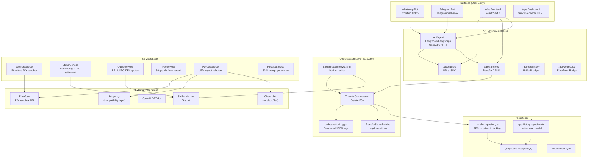
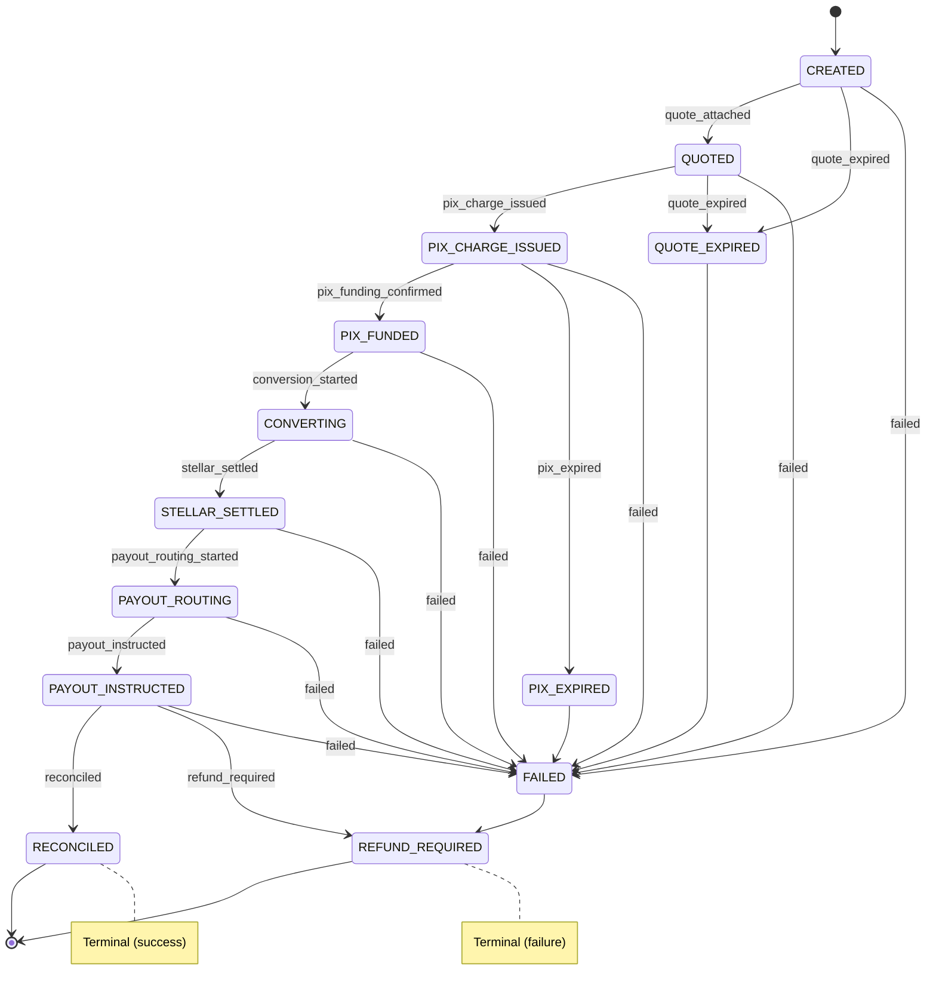
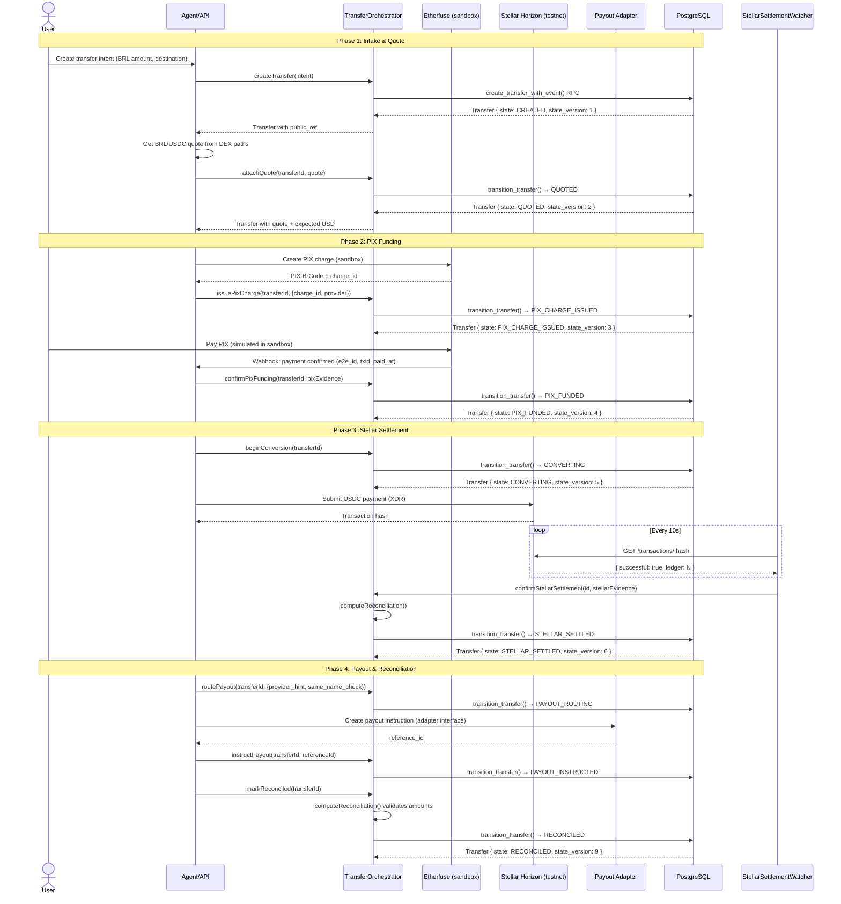

# Architecture Diagrams — Deliverable 3

> Source: `docs/project-brain/architecture/SYSTEM-MAP.md`, `docs/project-brain/architecture/MONEY-FLOWS.md`
> All diagrams use Mermaid syntax. Render at https://mermaid.live or in any Mermaid-compatible viewer.

---

## (a) System Component Architecture



### Module → File Map (Key Files for D3)

| Module | File Path | Lines |
|---|---|---|
| TransferOrchestrator | `backend/src/orchestration/TransferOrchestrator.ts` | 625 |
| State Machine | `backend/src/orchestration/stateMachine.ts` | 67 |
| Domain Types | `backend/src/orchestration/types.ts` | 182 |
| StellarSettlementWatcher | `backend/src/orchestration/stellarWatcher.ts` | 119 |
| Orchestration Logger | `backend/src/orchestration/orchestrationLogger.ts` | 72 |
| Decimal Utils | `backend/src/orchestration/decimal.ts` | ~60 |
| Transfer Repository | `backend/src/api/repository/transfer.repository.ts` | 369 |
| Ops History Repository | `backend/src/api/repository/ops-history.repository.ts` | 414 |
| Ops Controller | `backend/src/api/controllers/ops.controller.ts` | 779 |
| Ops Dashboard View | `backend/src/api/views/ops-dashboard.view.ts` | 1414 |
| Ops Router | `backend/src/api/routes/ops.router.ts` | 26 |
| Payout Adapters | `backend/src/api/services/usd-payout-adapters.ts` | ~500 |
| Payout Coordination | `backend/src/api/services/usd-payout-coordination.service.ts` | ~400 |
| Legacy Sync Bridge | `backend/src/api/services/international-transfer.service.ts:862-910` | 49 |
| DB Migration | `backend/migrations/20260613_00_full_schema.sql:2574-2700` | ~150 |

---

## (b) Transfer Lifecycle State Machine

### States (13 total)

```
CREATED → QUOTED → PIX_CHARGE_ISSUED → PIX_FUNDED → CONVERTING
    → STELLAR_SETTLED → PAYOUT_ROUTING → PAYOUT_INSTRUCTED → RECONCILED

Failure branches:
  CREATED → QUOTE_EXPIRED → FAILED
  QUOTED → QUOTE_EXPIRED → FAILED
  PIX_CHARGE_ISSUED → PIX_EXPIRED → FAILED
  Any active state → FAILED
  FAILED → REFUND_REQUIRED
  PAYOUT_INSTRUCTED → REFUND_REQUIRED
```

### Mermaid State Diagram



### Transition Enforcement

All transitions are enforced by `TransferStateMachine.canTransition()` in `backend/src/orchestration/stateMachine.ts:42`. Illegal transitions throw `IllegalTransitionError`. The state machine is the **single source of truth** — no code path can bypass it.

```typescript
// stateMachine.ts:8-22
const ALLOWED_TRANSITIONS: Record<TransferState, TransferState[]> = {
  CREATED:              ['QUOTED', 'QUOTE_EXPIRED', 'FAILED'],
  QUOTED:               ['PIX_CHARGE_ISSUED', 'QUOTE_EXPIRED', 'FAILED'],
  PIX_CHARGE_ISSUED:    ['PIX_FUNDED', 'PIX_EXPIRED', 'FAILED'],
  PIX_FUNDED:           ['CONVERTING', 'FAILED'],
  CONVERTING:           ['STELLAR_SETTLED', 'FAILED'],
  STELLAR_SETTLED:      ['PAYOUT_ROUTING', 'FAILED'],
  PAYOUT_ROUTING:       ['PAYOUT_INSTRUCTED', 'FAILED'],
  PAYOUT_INSTRUCTED:    ['RECONCILED', 'REFUND_REQUIRED', 'FAILED'],
  RECONCILED:           [],
  QUOTE_EXPIRED:        ['FAILED'],
  PIX_EXPIRED:          ['FAILED'],
  FAILED:               ['REFUND_REQUIRED'],
  REFUND_REQUIRED:      [],
};
```

### Database-Level Atomicity

State transitions are executed via the PostgreSQL RPC `transition_transfer()` (`backend/migrations/20260613_00_full_schema.sql:2632`):
- `SELECT ... FOR UPDATE` locks the row
- Checks `state_version` for optimistic locking (throws `40001` on conflict)
- Updates `state`, increments `state_version`, applies JSONB updates
- Inserts a `transfer_events` row atomically in the same transaction

---

## (c) Money Flow Sequence



### Evidence Points

At each phase, evidence is attached to the transfer record as immutable JSONB:

| Phase | Evidence Field | Verifiable At |
|---|---|---|
| Quote | `transfer.quote` (rate, fee_breakdown, expires_at) | `/ops/transfers/:id` → Quote section |
| PIX | `transfer.pix` (charge_id, e2e_id, txid, paid_at, payer_masked) | `/ops/transfers/:id` → Evidence & links panel |
| Stellar | `transfer.stellar` (tx_hash, ledger, settled_at, source_account_masked, asset, path_used) | `/ops/transfers/:id` → Evidence & links panel + stellar.expert link |
| Payout | `transfer.payout` (routing_status, provider_hint, reference_id, same_name_check) | `/ops/transfers/:id` → Evidence & links panel |
| Reconciliation | `transfer.reconciliation` (amounts_match, fees_total, discrepancies, reconciled_by) | `/ops/transfers/:id` → Reconciliation panel |
