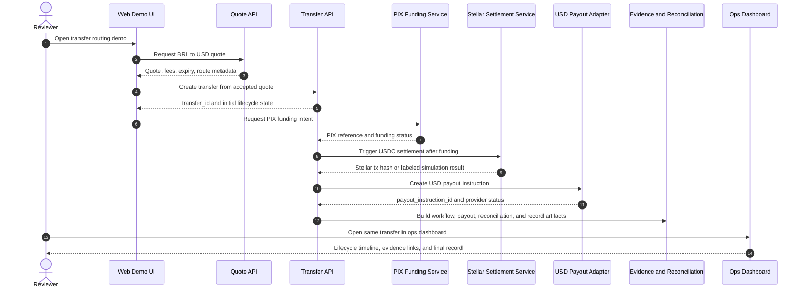
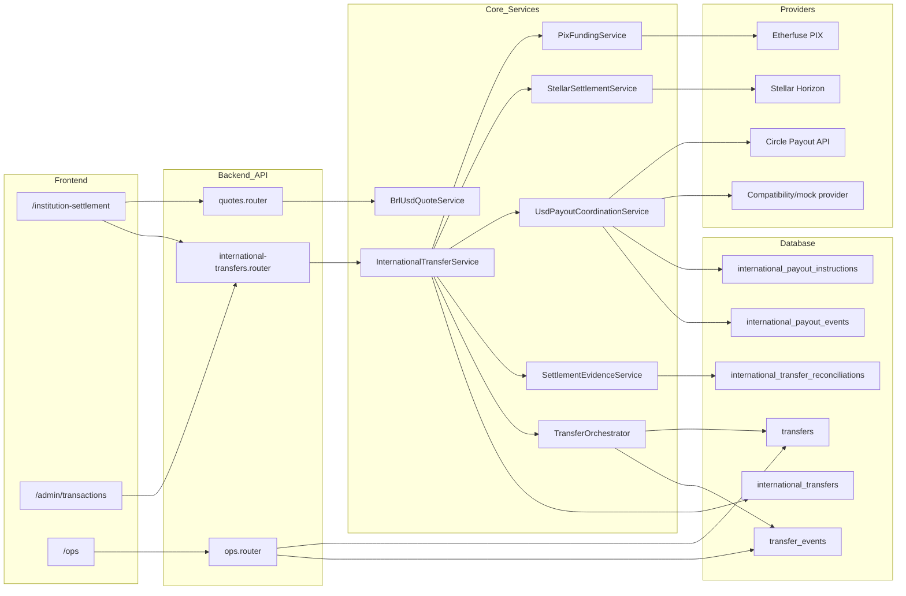
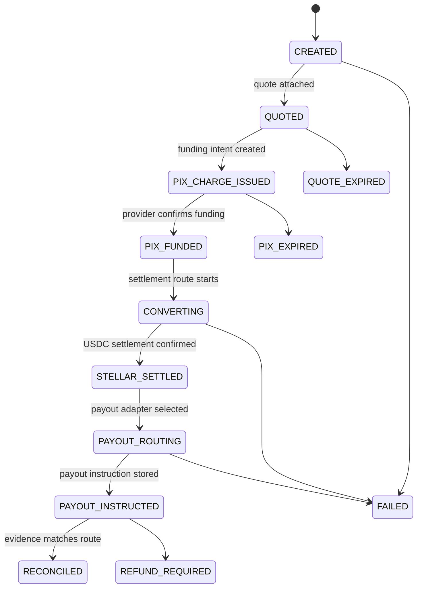
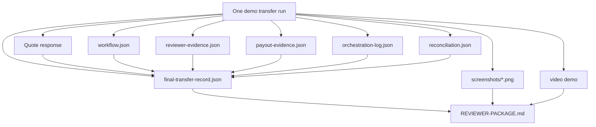
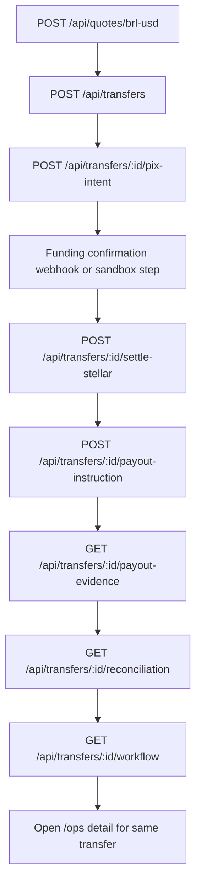

# Evidence - Diagramas de Arquitetura

## Status

Ready for reviewer submission. These Mermaid diagrams describe the complete transfer-routing demonstration from PIX intake through quote, Stellar settlement, payout instruction, evidence, and dashboard review.

## 1. End-to-End Reviewer Flow

## 2. Service Architecture

## 3. Lifecycle State Model

## 4. Evidence Artifact Model

## 5. API Walkthrough

## Code References

| Layer | File |
|---|---|
| Quote route | `backend/src/api/routes/quotes.router.ts` |
| Transfer routes | `backend/src/api/routes/international-transfers.router.ts` |
| Transfer service | `backend/src/api/services/international-transfer.service.ts` |
| PIX funding | `backend/src/api/services/pix-funding.service.ts` |
| Stellar settlement | `backend/src/api/services/stellar-settlement.service.ts` |
| Payout adapter | `backend/src/api/services/usd-payout-adapters.ts` |
| Payout coordination | `backend/src/api/services/usd-payout-coordination.service.ts` |
| Evidence builder | `backend/src/api/services/settlement-evidence.service.ts` |
| Lifecycle orchestrator | `backend/src/orchestration/TransferOrchestrator.ts` |
| Ops dashboard | `backend/src/api/controllers/ops.controller.ts` |
