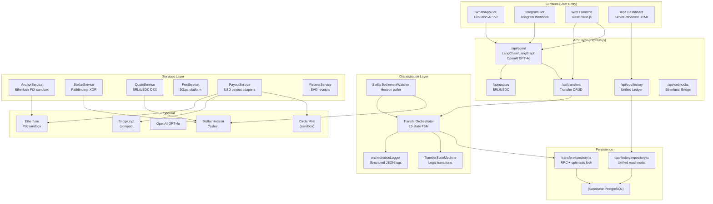
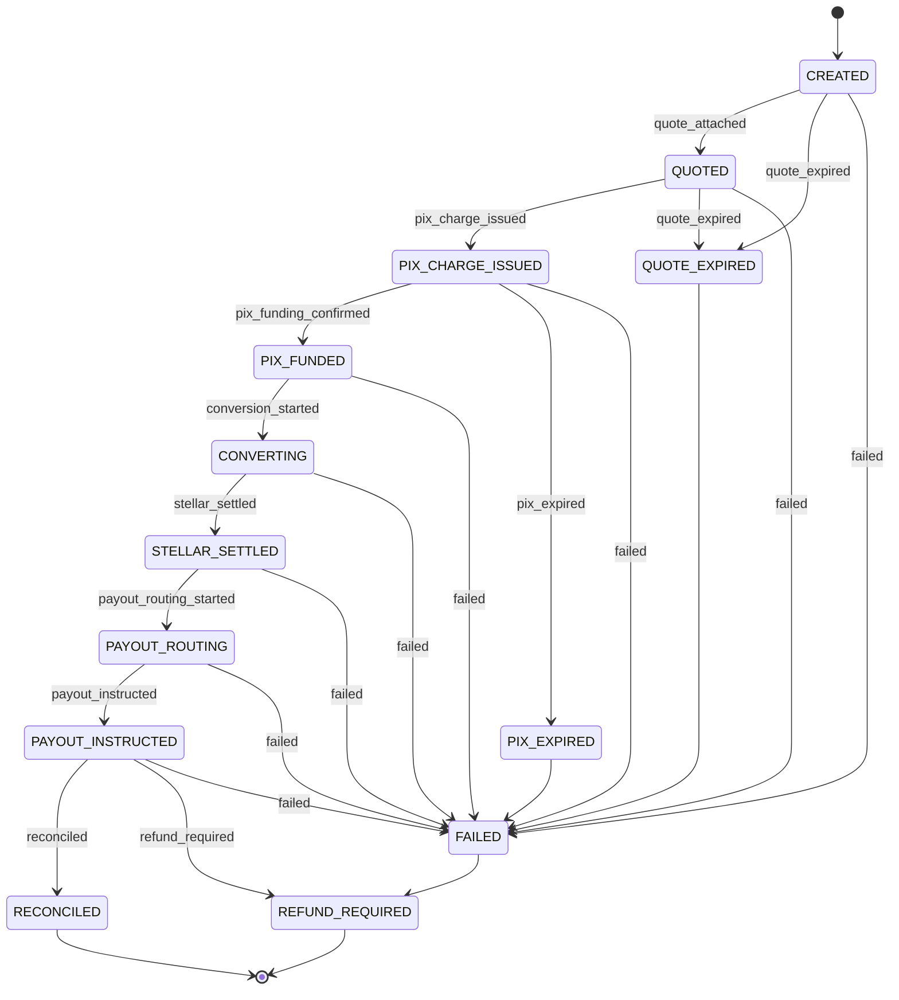
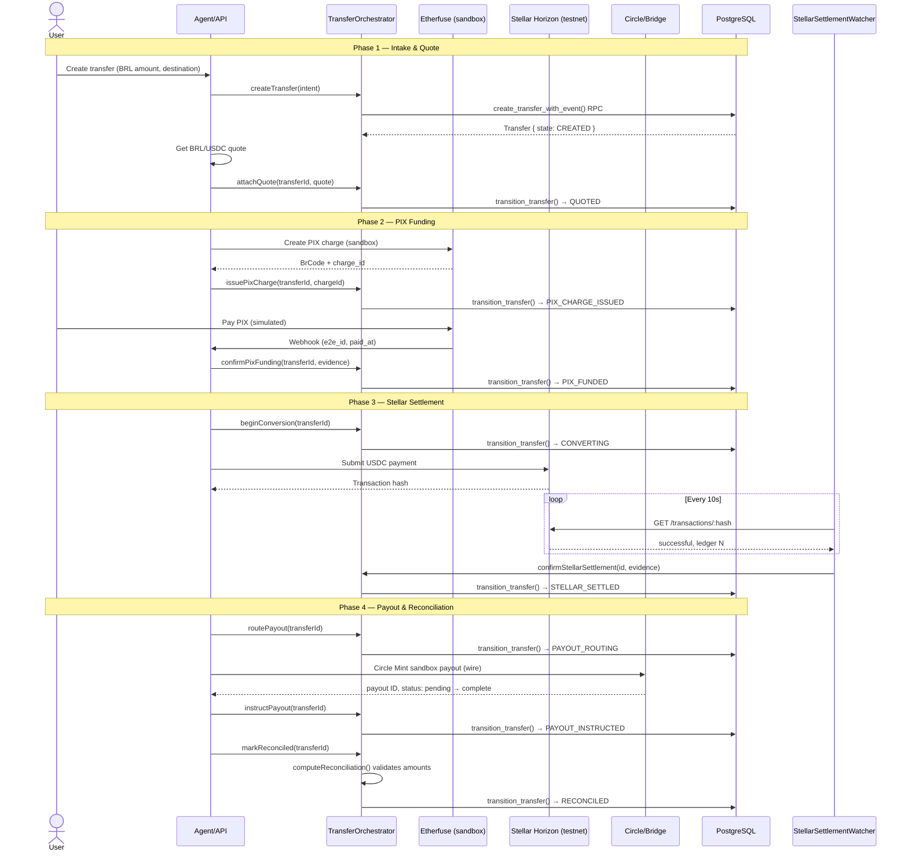

# D3 — Architecture Diagrams

Repo: https://github.com/rbfcdog/talk-to-stellar · branch `main` · commit `419673f`

Paste these into https://mermaid.live to render.

---

## System Components

Users enter via WhatsApp, Telegram, web, or the `/ops` dashboard. The agent interprets intent, routes to the orchestrator. The orchestrator drives the state machine, coordinating PIX intake (Etherfuse), Stellar settlement (Horizon), and USD payout (Circle/Bridge). Everything is persisted through PostgreSQL RPCs with optimistic locking.

---

## Transfer State Machine

13 states. The happy path goes CREATED through RECONCILED in 9 transitions. Failure branches cover expired quotes, expired PIX charges, generic failures, and refunds. Transitions are enforced by `TransferStateMachine.canTransition()` — illegal transitions throw before any side effect.

---

## Money Flow

BRL enters via PIX, gets converted to USDC on Stellar, settled with a verifiable tx hash, then paid out as USD via Circle wire. Every transition is atomic (PostgreSQL RPC), every event is append-only (triggers prevent edits), and reconciliation compares BRL in vs USDC settled vs USD out using decimal-safe arithmetic.
