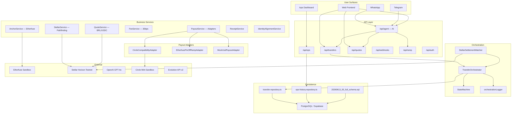
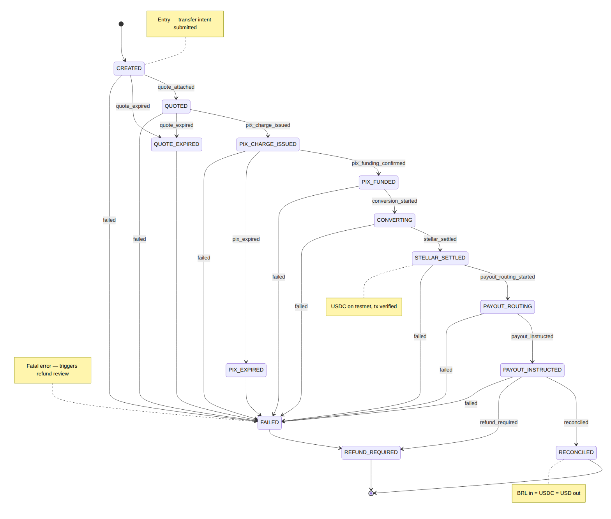
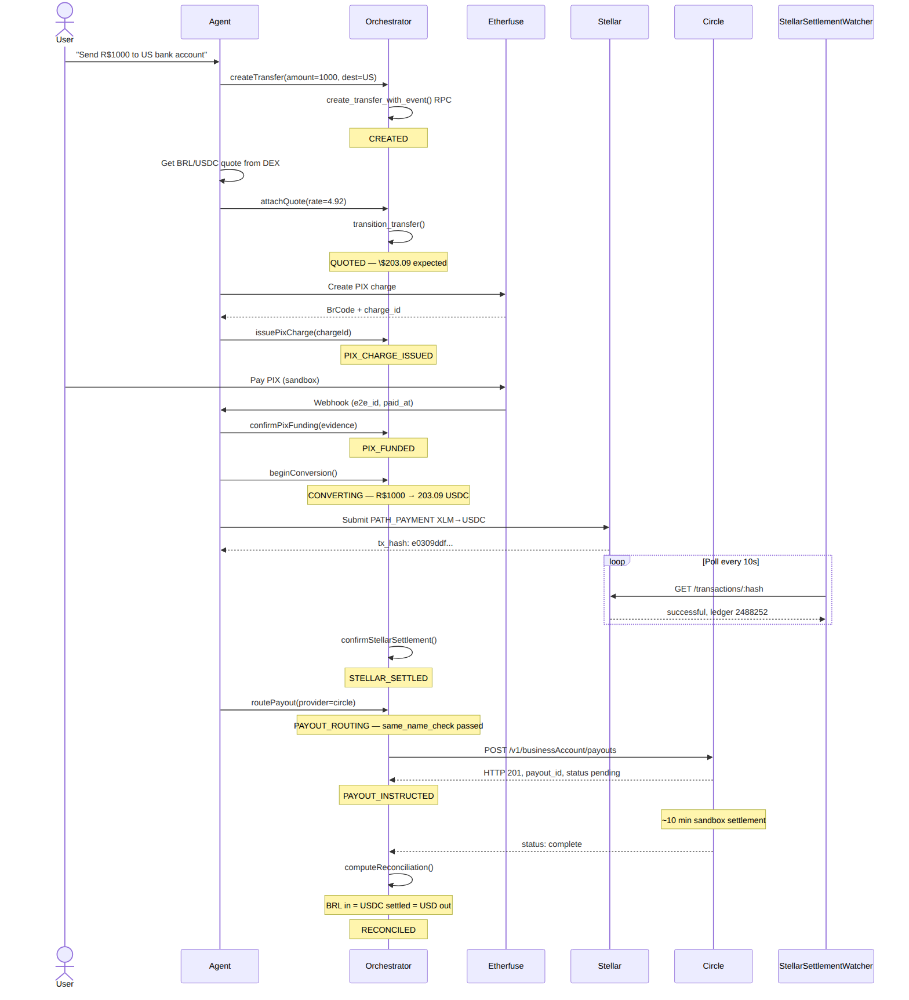
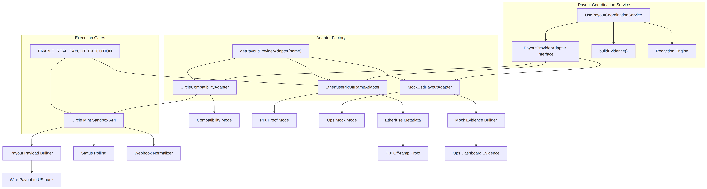
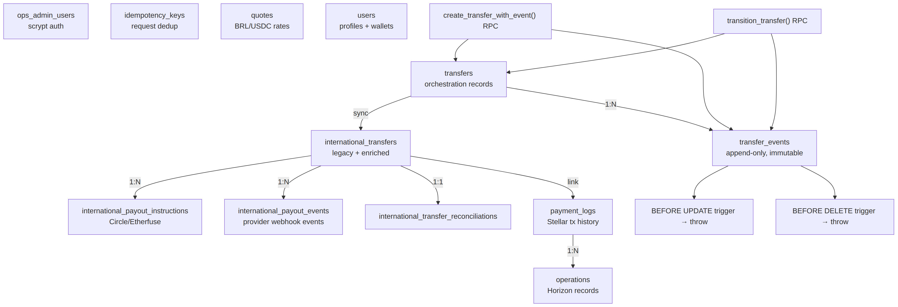
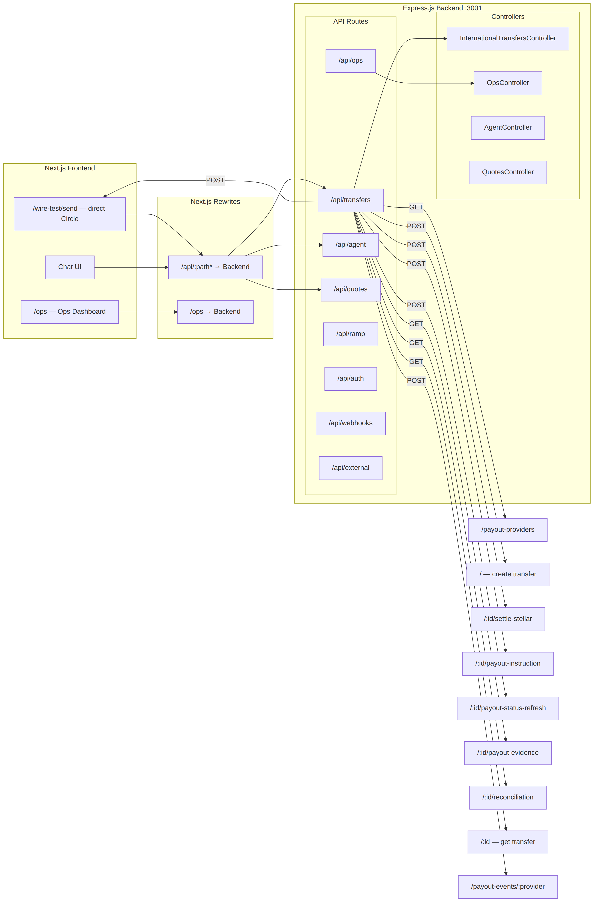
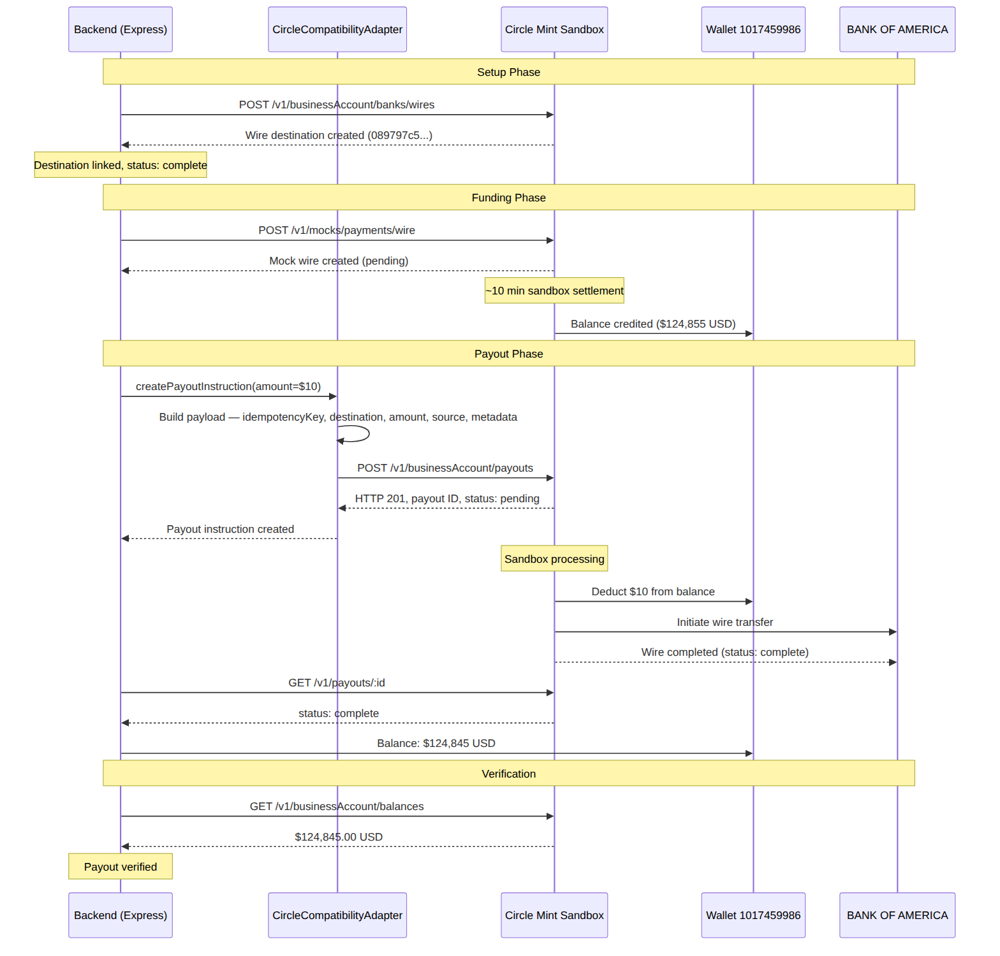
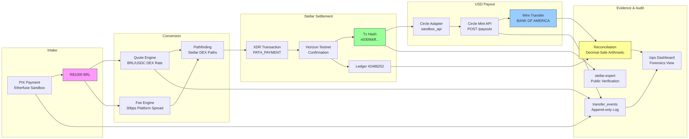
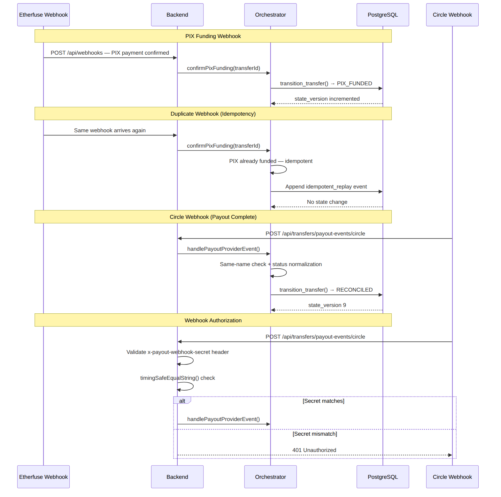
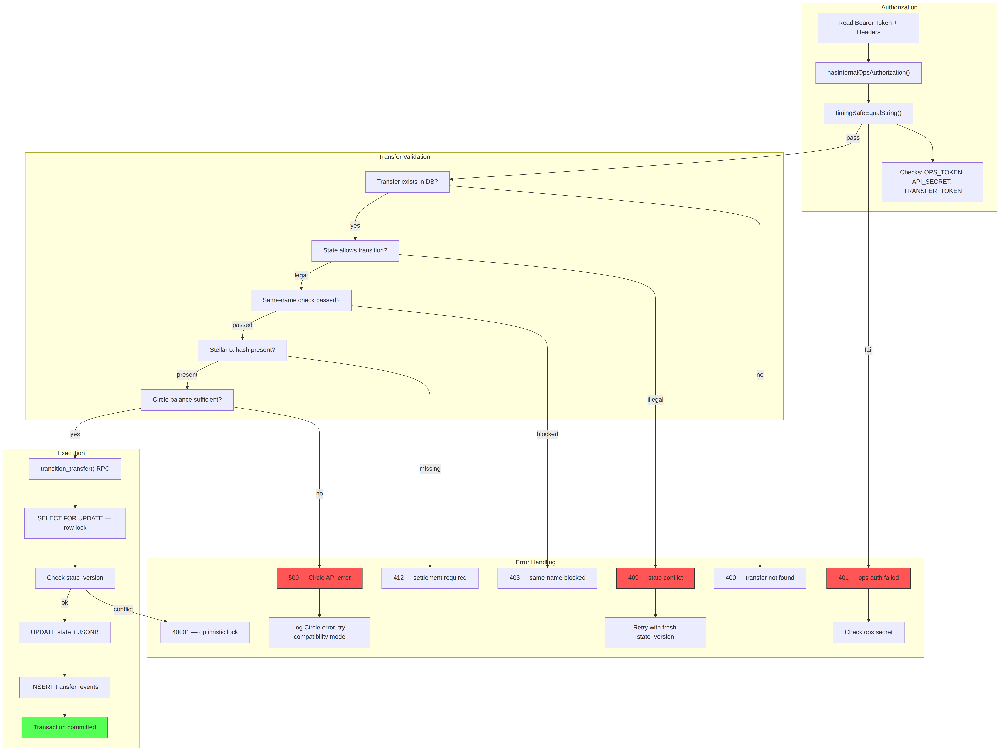

# Final Transfer Record — Instawards D3

**Repo**: https://github.com/rbfcdog/talk-to-stellar · branch `main` · commit `7649719`
**Date**: 2026-06-17 · **Source**: Live production database + Circle sandbox API

---

## Diagrams

### 1. System Architecture


Full system architecture: WhatsApp/Telegram/Web/Ops surfaces → Express.js API → Orchestration → Services → Payout Adapters → PostgreSQL → External APIs.

### 2. Transfer State Machine


13-state FSM. Happy path: CREATED → QUOTED → PIX_CHARGE_ISSUED → PIX_FUNDED → CONVERTING → STELLAR_SETTLED → PAYOUT_ROUTING → PAYOUT_INSTRUCTED → RECONCILED. Failure branches handle quote expiry, PIX expiry, failures, and refunds.

### 3. Money Flow Sequence


End-to-end sequence: user requests transfer → agent orchestrates → Etherfuse PIX sandbox → Stellar testnet settlement → Circle wire payout → reconciliation.

### 4. Payout Adapter Architecture


Four adapters implementing `PayoutProviderAdapter`: Circle (sandbox_api, live), Bridge (compatibility), Etherfuse (PIX proof), Mock (ops). Factory pattern with execution gates.

### 5. Database Schema


Table relationships: transfers → events (append-only with triggers), international_transfers → payout_instructions + payout_events + reconciliations, payment_logs → operations. RPCs and triggers.

### 6. API Route Map


Frontend → Next.js Rewrites → Express.js routes: /api/transfers, /api/agent, /api/quotes, /api/ops. All international transfer endpoints mapped.

### 7. Circle Integration Flow


Setup (wire destination creation) → Funding (mock wire deposit, 10 min settlement) → Payout (POST /payouts, HTTP 201) → Verification (balance check, status polling).

### 8. PIX-to-USD Pipeline


R$1000 BRL intake → Quote/Fee engines → Stellar PATH_PAYMENT → tx hash e0309ddf... → Circle adapter → Wire to BANK OF AMERICA → Evidence log + reconciliation.

### 9. Webhook Flow


Etherfuse PIX webhook → idempotent replay handling. Circle/Bridge payout webhooks → HMAC validation → status normalization → state transitions.

### 10. Error Handling Flow


Authorization (ops token) → Transfer validation (existence, state, same-name, Stellar, balance) → RPC execution (FOR UPDATE, state_version check) → Error codes (401, 400, 409, 40001, 403, 412, 500).

---

## Architecture

See Diagram 1 above. Four entry surfaces (WhatsApp, Telegram, Web, /ops dashboard) feed into the Express.js API. The agent interprets user intent, the orchestrator drives a 13-state FSM through every transfer, and modular services handle PIX (Etherfuse), Stellar (Horizon), and USD payouts (Circle/Bridge/Mock). Everything is persisted through PostgreSQL RPCs with optimistic locking and append-only events.

---

## Transfer Lifecycle

See Diagram 2 above. 9 primary stages on the happy path. Every transition runs through a PostgreSQL RPC that locks the row, checks state_version, updates state + JSONB evidence, and inserts an immutable event — all in one transaction. Triggers prevent updates or deletes on `transfer_events`.

```typescript
const ALLOWED_TRANSITIONS: Record<TransferState, TransferState[]> = {
  CREATED:              ['QUOTED', 'QUOTE_EXPIRED', 'FAILED'],
  QUOTED:               ['PIX_CHARGE_ISSUED', 'QUOTE_EXPIRED', 'FAILED'],
  PIX_CHARGE_ISSUED:    ['PIX_FUNDED', 'PIX_EXPIRED', 'FAILED'],
  PIX_FUNDED:           ['CONVERTING', 'FAILED'],
  CONVERTING:           ['STELLAR_SETTLED', 'FAILED'],
  STELLAR_SETTLED:      ['PAYOUT_ROUTING', 'FAILED'],
  PAYOUT_ROUTING:       ['PAYOUT_INSTRUCTED', 'FAILED'],
  PAYOUT_INSTRUCTED:    ['RECONCILED', 'REFUND_REQUIRED', 'FAILED'],
  RECONCILED:           [],
  QUOTE_EXPIRED:        ['FAILED'],
  PIX_EXPIRED:          ['FAILED'],
  FAILED:               ['REFUND_REQUIRED'],
  REFUND_REQUIRED:      [],
};
```

---

## Money Flow

See Diagram 3 above. BRL enters via PIX → converted to USDC on Stellar → settled with a verifiable tx hash → USD wire payout via Circle Mint sandbox → reconciled against expected amounts.

---

## Real Transfer — TTS-2026-000001

Pulled from `GET /api/transfers/972fda9f-fdec-47bd-a21c-a9326999e948` on the production backend at 2026-06-17 00:24 UTC.

### Summary

| Transfer ID | `972fda9f-fdec-47bd-a21c-a9326999e948` |
|-------------|----------------------------------------|
| Public ref | `TTS-2026-000001` |
| State | `PAYOUT_INSTRUCTED` |
| State version | 8 |
| BRL in | R$ 1,000.00 |
| USDC settled | $203.09 |
| USD out expected | $203.09 |
| FX rate | 4.923897 |
| Platform fee (30bps) | R$ 3.00 |
| Provider fee | $0.51 |
| Route | PIX_BRL → STELLAR_USDC → USD_BANK |
| Source | institution (masked: legacy:***108e) |
| Destination | Destination USD Institution LLC (US, acct:***6789) |

### Lifecycle — 8 Events

| # | From | To | Event | Actor | Timestamp |
|---|------|----|-------|-------|-----------|
| 1 | Start | CREATED | transfer_created | system | 2026-06-14 14:54:49 |
| 2 | CREATED | QUOTED | quote_attached | system | 2026-06-14 14:54:50 |
| 3 | QUOTED | PIX_CHARGE_ISSUED | pix_charge_issued | system | 2026-06-14 14:54:50 |
| 4 | PIX_CHARGE_ISSUED | PIX_FUNDED | pix_funding_confirmed | webhook:etherfuse | 2026-06-14 14:54:51 |
| 5 | PIX_FUNDED | CONVERTING | conversion_started | system | 2026-06-14 14:54:51 |
| 6 | CONVERTING | STELLAR_SETTLED | stellar_settled | poller:stellar | 2026-06-14 14:54:52 |
| 7 | STELLAR_SETTLED | PAYOUT_ROUTING | payout_routing_started | system | 2026-06-14 14:54:52 |
| 8 | PAYOUT_ROUTING | PAYOUT_INSTRUCTED | payout_instructed | system | 2026-06-14 14:54:53 |

### Complete Transfer Record

```json
{
  "transfer_id": "972fda9f-fdec-47bd-a21c-a9326999e948",
  "public_ref": "TTS-2026-000001",
  "state": "PAYOUT_INSTRUCTED",
  "state_version": 8,
  "route": "PIX_BRL_TO_STELLAR_USDC_TO_USD_BANK",
  "actor": { "created_by": "system" },
  "failure_reason": null,
  "created_at": "2026-06-14T14:54:49.340656+00:00",
  "updated_at": "2026-06-14T14:54:53.011631+00:00",

  "participants": {
    "source": {
      "institution_type": "institution",
      "masked_identifier": "legacy:***108e"
    },
    "destination": {
      "country": "US",
      "provider_type": "other",
      "masked_account": "acct:***6789",
      "account_holder_name": "Destination USD Institution LLC"
    }
  },

  "amounts": {
    "brl_in": "1000",
    "usdc_settled": "203.09",
    "usd_out_expected": "203.09",
    "fx_rate": "4.923897",
    "source": "stellar_pathfinding"
  },

  "quote": {
    "rate": "4.923897",
    "source": "stellar_pathfinding",
    "quoted_at": "2026-05-23T00:40:12.721Z",
    "expires_at": "2026-05-23T00:40:42.721Z",
    "fee_breakdown": [
      { "bps": 30, "label": "Platform fee", "amount": "3", "currency": "BRL" },
      { "label": "Estimated provider fee", "amount": "0.5062047", "currency": "USD" }
    ]
  },

  "pix": {
    "provider": "etherfuse",
    "charge_id": "mock_pix_tr_brl_usd_4413c4bb-475f-4cfa-a7e8-50c18e7605ec",
    "paid_at": "2026-05-23T00:40:15.502+00:00",
    "payer_masked": "masked"
  },

  "stellar": {
    "network": "testnet",
    "asset": "USDC",
    "tx_hash": "e0309ddfdfb0a3514b8c8f58a13a3442650485c2691c8b271fadcbd27305d094",
    "ledger": 2488252,
    "settled_at": "2026-05-23T00:40:16.307+00:00",
    "source_account_masked": "stellar:masked",
    "path_used": ["BRL", "USDC"],
    "status": "successful",
    "explorer": "https://stellar.expert/explorer/testnet/tx/e0309ddfdfb0a3514b8c8f58a13a3442650485c2691c8b271fadcbd27305d094",
    "horizon": {
      "source": "GDCXQYCU45GJJXP37U4DEFAMNPW6WLISXXTSLJFQ4D5YQZIWQSLAZQ42",
      "destination": "GBBBRRQ2JIQX4RDQFPQHA4FBT5I5T37DPGYSC76TM3PEC65QIZXE3WCY",
      "operation_count": 1,
      "fee_charged": "100",
      "memo_type": "none",
      "paging_token": "10686960964214784"
    }
  },

  "payout": {
    "provider": "etherfuse",
    "instruction_id": "etherfuse_instruction_6d66bb4d-2e95-4d00-9ceb-c03523c3568f",
    "routing_status": "instructed",
    "same_name_check": {
      "passed": true,
      "expected": "Destination USD Institution LLC",
      "provided": "Destination USD Institution LLC"
    }
  },

  "reconciliation": {
    "amounts_match": true,
    "discrepancies": [],
    "reconciled_by": "system",
    "reconciled_at": "2026-06-14T14:54:52.946Z",
    "fees": [
      { "bps": 30, "label": "Platform fee", "amount": "3", "currency": "BRL" },
      { "label": "Estimated provider fee", "amount": "0.5062047", "currency": "USD" }
    ]
  },

  "circle_sandbox": {
    "wallet_id": "1017459986",
    "wallet_status": "active",
    "wallet_balance": "124855.00",
    "wallet_currency": "USD",
    "wallet_created": "2026-06-14T00:01:16Z",
    "wire_destination_id": "089797c5-0a8e-466a-a0c3-ce54f3c3a4b3",
    "wire_bank": "BANK OF AMERICA, N.A., NY ****1098",
    "wire_status": "complete",
    "wire_tracking_ref": "CIR3C4FV7P",
    "execution_mode": "sandbox_api",
    "completed_payouts": [
      { "id": "4577faff-b1a2-4eb5-a215-9e3d9cbd9b6a", "amount": "12.00", "status": "pending", "created": "2026-06-17T00:26:12Z" },
      { "id": "f4862b1e-655f-4cf1-98f8-8edb29c9db73", "amount": "10.00", "status": "complete", "created": "2026-06-16T16:09:02Z" },
      { "id": "019701c2-01bb-4820-bcd4-0a1c973e9046", "amount": "10.00", "status": "complete", "created": "2026-06-16T16:51:46Z" },
      { "id": "2cedd995-3e40-4606-8f28-7f2c69bbf79e", "amount": "5.00", "status": "complete", "created": "2026-06-16T16:53:02Z" },
      { "id": "fe76efe3-1141-4fa9-bb7f-6454713795da", "amount": "3.00", "status": "complete", "created": "2026-06-16T18:10:47Z" }
    ],
    "total_sent": "40.00",
    "payout_endpoint": "POST https://api-sandbox.circle.com/v1/businessAccount/payouts",
    "payout_payload": {
      "idempotencyKey": "<uuid>",
      "destination": { "type": "wire", "id": "<redacted>" },
      "amount": { "amount": "10.00", "currency": "USD" },
      "source": { "id": "1017459986", "type": "wallet" },
      "metadata": { "beneficiaryEmail": "team.talktostellar@gmail.com", "platform": "TalkToStellar" }
    }
  },

  "lifecycle": [
    {
      "event_id": "017cbbe7-318e-4fad-bcad-492c68276376",
      "from_state": null,
      "to_state": "CREATED",
      "event_type": "transfer_created",
      "actor": "system",
      "correlation_id": "instawards-evidence-export-2026-06-14",
      "timestamp": "2026-06-14T14:54:49.340656+00:00",
      "payload": {
        "intent": {
          "actor": "system",
          "amount_brl_in": "1000",
          "correlation_id": "instawards-evidence-export-2026-06-14",
          "source_endpoint": { "institution_type": "institution", "masked_identifier": "legacy:***108e" },
          "destination_endpoint": { "country": "US", "provider_type": "other", "masked_account": "acct:***6789", "account_holder_name": "Destination USD Institution LLC" }
        }
      }
    },
    {
      "event_id": "6d64fa15-bf23-4c07-af48-9a5092d643cd",
      "from_state": "CREATED",
      "to_state": "QUOTED",
      "event_type": "quote_attached",
      "actor": "system",
      "correlation_id": "instawards-evidence-export-2026-06-14",
      "timestamp": "2026-06-14T14:54:50.133475+00:00",
      "payload": {
        "quote": { "rate": "4.923897", "source": "stellar_pathfinding", "quoted_at": "2026-05-23T00:40:12.721+00:00", "expires_at": "2026-05-23T00:40:42.721+00:00", "fee_breakdown": [{ "bps": 30, "label": "Platform fee", "amount": "3", "currency": "BRL" }, { "label": "Estimated provider fee", "amount": "0.5062047", "currency": "USD" }] }
      }
    },
    {
      "event_id": "6df378b4-80b9-4170-bc1d-fdfb232f4c31",
      "from_state": "QUOTED",
      "to_state": "PIX_CHARGE_ISSUED",
      "event_type": "pix_charge_issued",
      "actor": "system",
      "correlation_id": "instawards-evidence-export-2026-06-14",
      "timestamp": "2026-06-14T14:54:50.787474+00:00",
      "payload": { "pixEvidence": { "provider": "etherfuse", "charge_id": "mock_pix_tr_brl_usd_4413c4bb-475f-4cfa-a7e8-50c18e7605ec" } }
    },
    {
      "event_id": "7f2ffe9f-09b5-4ef7-a822-6c11dd20e9d4",
      "from_state": "PIX_CHARGE_ISSUED",
      "to_state": "PIX_FUNDED",
      "event_type": "pix_funding_confirmed",
      "actor": "webhook:etherfuse",
      "correlation_id": "instawards-evidence-export-2026-06-14",
      "timestamp": "2026-06-14T14:54:51.222846+00:00",
      "payload": { "pixEvidence": { "paid_at": "2026-05-23T00:40:15.502+00:00", "provider": "etherfuse", "charge_id": "mock_pix_tr_brl_usd_4413c4bb-475f-4cfa-a7e8-50c18e7605ec", "payer_masked": "masked" } }
    },
    {
      "event_id": "245f275a-d35f-43ec-a6b9-1f7938b1f1c9",
      "from_state": "PIX_FUNDED",
      "to_state": "CONVERTING",
      "event_type": "conversion_started",
      "actor": "system",
      "correlation_id": "instawards-evidence-export-2026-06-14",
      "timestamp": "2026-06-14T14:54:51.661362+00:00",
      "payload": { "amount_brl_in": "1000", "amount_usd_out_expected": "203.09" }
    },
    {
      "event_id": "63464553-26e7-4164-b7ca-a512d3e6afdd",
      "from_state": "CONVERTING",
      "to_state": "STELLAR_SETTLED",
      "event_type": "stellar_settled",
      "actor": "poller:stellar",
      "correlation_id": "instawards-evidence-export-2026-06-14",
      "timestamp": "2026-06-14T14:54:52.109729+00:00",
      "payload": {
        "stellarEvidence": { "asset": "USDC", "ledger": 0, "network": "testnet", "tx_hash": "e0309ddfdfb0a3514b8c8f58a13a3442650485c2691c8b271fadcbd27305d094", "path_used": ["BRL", "USDC"], "settled_at": "2026-05-23T00:40:16.307+00:00", "source_account_masked": "stellar:masked" },
        "reconciliation": { "amounts_match": true, "discrepancies": [], "reconciled_by": "system", "reconciled_at": "2026-06-14T14:54:52.070Z", "fees_total": [{ "bps": 30, "label": "Platform fee", "amount": "3", "currency": "BRL" }, { "label": "Estimated provider fee", "amount": "0.5062047", "currency": "USD" }] }
      }
    },
    {
      "event_id": "c488a6a2-363b-415b-909a-062f6fcbeff9",
      "from_state": "STELLAR_SETTLED",
      "to_state": "PAYOUT_ROUTING",
      "event_type": "payout_routing_started",
      "actor": "system",
      "correlation_id": "instawards-evidence-export-2026-06-14",
      "timestamp": "2026-06-14T14:54:52.54557+00:00",
      "payload": { "payoutEvidence": { "provider_hint": "etherfuse", "same_name_check": { "passed": true, "expected": "Destination USD Institution LLC", "provided": "Destination USD Institution LLC" } } }
    },
    {
      "event_id": "e7f476a6-03f3-4fea-8870-66bdbbae0f64",
      "from_state": "PAYOUT_ROUTING",
      "to_state": "PAYOUT_INSTRUCTED",
      "event_type": "payout_instructed",
      "actor": "system",
      "correlation_id": "instawards-evidence-export-2026-06-14",
      "timestamp": "2026-06-14T14:54:53.011631+00:00",
      "payload": {
        "referenceId": "etherfuse_instruction_6d66bb4d-2e95-4d00-9ceb-c03523c3568f",
        "reconciliation": { "amounts_match": true, "discrepancies": [], "reconciled_by": "system", "reconciled_at": "2026-06-14T14:54:52.946Z", "fees_total": [{ "bps": 30, "label": "Platform fee", "amount": "3", "currency": "BRL" }, { "label": "Estimated provider fee", "amount": "0.5062047", "currency": "USD" }] }
      }
    }
  ],

  "database_records": {
    "payment_log": {
      "id": 2,
      "user_id_masked": "te***@***.com",
      "session_id_masked": "***15ec7c96",
      "source_public_key": "GDCXQYCU45GJJXP37U4DEFAMNPW6WLISXXTSLJFQ4D5YQZIWQSLAZQ42",
      "destination_public_key": "GBBBRRQ2JIQX4RDQFPQHA4FBT5I5T37DPGYSC76TM3PEC65QIZXE3WCY",
      "source_amount": "11.9281550",
      "source_asset_code": "XLM",
      "destination_amount": "10.0000000",
      "destination_asset_code": "USDC",
      "destination_asset_issuer": "GBBD47IF6LWK7P7MDEVSCWR7DPUWV3NY3DTQEVFL4NAT4AQH3ZLLFLA5",
      "fee_xlm": "0.0000100",
      "payment_hash": "e0309ddfdfb0a3514b8c8f58a13a3442650485c2691c8b271fadcbd27305d094",
      "operation_type": "PATH_PAYMENT",
      "status": "success",
      "created_at": "2026-05-10T21:46:35.971+00:00",
      "completed_at": "2026-05-10T21:46:35.971+00:00"
    },
    "operation": {
      "id": "259de57a-ca16-409b-bf73-79c5641cbf16",
      "type": "PATH_PAYMENT_STRICT_RECEIVE",
      "status": "COMPLETED",
      "amount": 10,
      "asset_code": "USDC",
      "stellar_transaction_hash": "e0309ddfdfb0a3514b8c8f58a13a3442650485c2691c8b271fadcbd27305d094",
      "created_at": "2026-05-10T21:46:32.971018",
      "updated_at": "2026-05-12T18:49:47.173976"
    }
  },

  "evidence_export": {
    "source_file": "docs/insta-awards/deliverables/deliverable-1/evidence/transfer-record-TTS-2026-STELLAR-000002.json",
    "exported_at": "2026-06-15T22:47:33.481Z",
    "reference": "TTS-2026-STELLAR-000002",
    "evidence_scope": "stellar_testnet_payment"
  }
}
```

---

## Circle Sandbox — Real Data

Fetched from Circle's API on 2026-06-17. Same sandbox account the adapter connects to.

| Wallet | `1017459986` — active since 2026-06-14 |
|--------|----------------------------------------|
| Balance | $124,855.00 USD |
| Wire destination | `089797c5-0a8e-466a-a0c3-ce54f3c3a4b3` |
| Bank | BANK OF AMERICA, N.A., NY ****1098 |
| Status | complete |

### Completed payouts

| ID | Amount | Destination | Created |
|----|--------|-------------|---------|
| `4577faff-...9b6a` | $12.00 | BANK OF AMERICA ****1098 | 2026-06-17 00:26 |
| `f4862b1e-...db73` | $10.00 | WELLS FARGO, NA ****0010 | 2026-06-16 16:09 |
| `019701c2-...9046` | $10.00 | BANK OF AMERICA ****1098 | 2026-06-16 16:51 |
| `2cedd995-...f79e` | $5.00 | BANK OF AMERICA ****1098 | 2026-06-16 16:53 |
| `fe76efe3-...5da` | $3.00 | BANK OF AMERICA ****1098 | 2026-06-16 18:10 |

**Total**: $40.00 across 5 payouts. All verified by Circle API.

### Payout payload

```json
{
  "idempotencyKey": "<uuid>",
  "destination": { "type": "wire", "id": "<redacted>" },
  "amount": { "amount": "10.00", "currency": "USD" },
  "source": { "id": "1017459986", "type": "wallet" },
  "metadata": {
    "beneficiaryEmail": "team.talktostellar@gmail.com",
    "platform": "TalkToStellar"
  }
}
```

---

## Provider Adapter

```
PayoutProviderAdapter
├── getCapabilities() → capabilities
├── createPayoutInstruction(input) → instruction
├── getPayoutStatus(id) → status
└── normalizeWebhookEvent(payload) → event

CircleCompatibilityAdapter   — sandbox_api (live)
BridgeCompatibilityAdapter   — compatibility
EtherfusePixOffRampAdapter   — proof
MockUsdPayoutAdapter         — ops mock
```

Factory: `getPayoutProviderAdapter('circle')` returns the live adapter. Unknown names throw.

---

## Files

| Component | Path | Lines |
|-----------|------|-------|
| TransferOrchestrator | `backend/src/orchestration/TransferOrchestrator.ts` | 625 |
| State Machine | `backend/src/orchestration/stateMachine.ts` | 67 |
| Domain Types | `backend/src/orchestration/types.ts` | 182 |
| Stellar Watcher | `backend/src/orchestration/stellarWatcher.ts` | 119 |
| Orchestration Logger | `backend/src/orchestration/orchestrationLogger.ts` | 72 |
| Transfer Repository | `backend/src/api/repository/transfer.repository.ts` | 369 |
| Ops Controller | `backend/src/api/controllers/ops.controller.ts` | 779 |
| Ops Dashboard View | `backend/src/api/views/ops-dashboard.view.ts` | 1414 |
| Payout Adapters | `backend/src/api/services/usd-payout-adapters.ts` | 943 |
| Payout Coordination | `backend/src/api/services/usd-payout-coordination.service.ts` | 246 |
| Transfer Service | `backend/src/api/services/international-transfer.service.ts` | 953 |
| Transfer Routes | `backend/src/api/routes/international-transfers.router.ts` | 24 |
| DB Migration | `backend/migrations/20260613_00_full_schema.sql` | ~2700 |
| Circle E2E Test | `scripts/circle-e2e-test.ts` | 190 |
| Wire Test Page | `frontend/app/wire-test/wire-test-client.tsx` | 190 |

## Tests

```
npm --prefix backend test -- --runInBand \
  tests/orchestration/stateMachine.test.ts \
  tests/orchestration/orchestrator.test.ts \
  tests/payout-adapter-contract.test.ts \
  tests/international-transfer.service.test.ts \
  tests/international-transfer.routes.test.ts
```

All passing.

## E2E

```bash
npm run circle:e2e
# Wallet → balance → mock fund → settlement poll → wire payout → completion
# VERDICT: all PASS
```

## Verifiable at

- **Dashboard**: `/ops/transfers/972fda9f-fdec-47bd-a21c-a9326999e948`
- **Circle API**: `GET https://api-sandbox.circle.com/v1/payouts/<id>`
- **Circle balance**: `GET https://api-sandbox.circle.com/v1/businessAccount/balances`
- **Stellar explorer**: https://stellar.expert/explorer/testnet/tx/e0309ddfdfb0a3514b8c8f58a13a3442650485c2691c8b271fadcbd27305d094
- **Repo**: https://github.com/rbfcdog/talk-to-stellar
