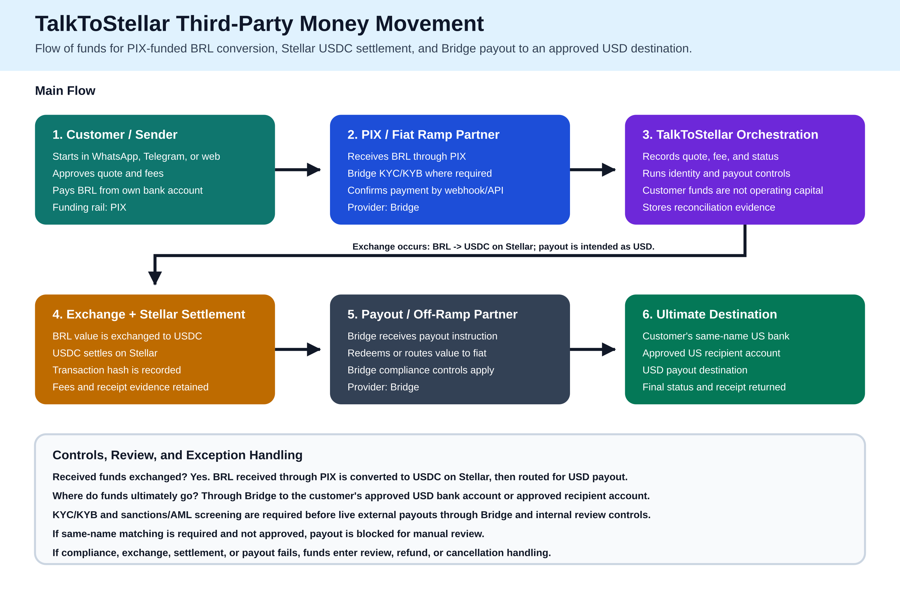

# Third-Party Money Movement - Flow of Funds

Last updated: 2026-06-22

## Submission-Ready Diagram

- Clear SVG: [`third-party-money-movement-flow-of-funds.svg`](./third-party-money-movement-flow-of-funds.svg)
- Clear PNG: [`third-party-money-movement-flow-of-funds.png`](./third-party-money-movement-flow-of-funds.png)



## Intended Use Case

TalkToStellar is a conversational money movement platform for users who want to move Brazilian reais into usable dollar value or approved payout destinations. The user starts from WhatsApp, Telegram, or web, receives a quote and fee disclosure, funds the transaction with PIX, and receives a receipt with Stellar and provider evidence when settlement completes.

## Flow of Funds

1. The customer initiates a transfer request and approves a quote.
2. The customer sends BRL from the customer's own Brazilian bank account through PIX.
3. Bridge receives the BRL through the regulated PIX/fiat-ramp path and confirms the payment to TalkToStellar through a provider webhook or API event.
4. TalkToStellar records the transfer lifecycle, quote, fees, identity controls, and reconciliation evidence. Customer funds are used only to complete the customer's requested transaction and are not treated as TalkToStellar operating capital.
5. The received BRL value is exchanged into USDC for Stellar settlement. The Stellar transaction hash and settlement evidence are stored for audit and receipt purposes.
6. Bridge receives the payout/off-ramp instruction and routes the value to the approved USD destination.
7. Funds ultimately land in the customer's designated US destination, such as a same-name US bank account or an approved recipient account.

## Currency Exchange

Yes. Received BRL funds are intended to be exchanged for another currency or asset. The primary route is:

```text
BRL received by PIX -> USDC on Stellar -> USD payout to approved destination
```

This submission describes the primary BRL-to-USD route. The received BRL is exchanged into USDC for Stellar settlement, and the payout leg is intended to deliver USD value to the approved destination.

## Ultimate Destination of Funds

Funds are ultimately sent through Bridge to the customer's approved USD destination account. The expected destination is a US bank account or approved payout endpoint associated with the customer or approved recipient.

TalkToStellar does not intend to use customer transfer funds for company expenses, investment, lending, or treasury operations. The platform fee is a disclosed spread collected separately from the customer transfer amount.

## Compliance and Control Points

- KYC/KYB: Handled through Bridge where applicable.
- AML/sanctions/PEP screening: Required before live external payouts through Bridge controls and internal review procedures.
- Same-name controls: Payout creation can be blocked when same-name matching is required and the match status is not approved.
- Transaction monitoring: Transfer records, provider events, Stellar settlement evidence, and reconciliation records are retained.
- Exceptions: If compliance, settlement, or payout fails, the transfer enters review, refund, or cancellation handling instead of proceeding to payout.

## Evidence Paths

- Flow architecture: `docs/project-brain/architecture/MONEY-FLOWS.md`
- Provider integrations: `docs/project-brain/architecture/INTEGRATIONS.md`
- Compliance questionnaire: `docs/compliance-questionnaire.md`
- Live-funds gates: `docs/project-brain/operations/ENVIRONMENTS.md`
- Production decision points: `docs/settlement/BRL_USD_RAIL_OPERATOR_RUNBOOK.md`
