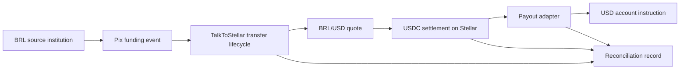

# 30-Day Execution Plan From Current State

This plan assumes the current repository state as the starting point. The goal
is to turn the existing institutional settlement prototype into a clean
reviewer-ready Instawards package.

## Week 1: Lifecycle Engine Hardening

Goal:

Make the transfer lifecycle engine reliable, observable, and easy to verify.

Work:

- Confirm `20260520_00_international_usd_transfers.sql` is applied in the
  target Supabase project.
- Add HTTP route tests for:
  - quote creation;
  - transfer creation;
  - Pix intent creation;
  - funding confirmation;
  - Stellar settlement;
  - payout instruction;
  - reconciliation read.
- Add failure-state tests for:
  - expired quote;
  - Pix funding failed;
  - settlement failed;
  - payout failed;
  - refund path.
- Add idempotency expectations for repeat funding and settlement events.
- Make quote provenance explicit in API responses:
  - live path quote;
  - Etherfuse quote;
  - configured fallback;
  - mock/sandbox.
- Add structured log correlation IDs across quote, transfer, Pix, Stellar,
  payout, and reconciliation.

Expected output:

- Transfer lifecycle is deterministic under tests.
- Reviewers can see which quote source was used.
- Failure modes are demonstrable rather than hidden.
- A sample transfer can be followed from first quote to final reconciliation.

Evidence:

- Test output.
- One successful transfer record.
- One failed transfer record.
- Reconciliation JSON.
- Backend logs with one correlation ID.

## Week 2: Payout Adapter Validation

Goal:

Prove that the provider-agnostic payout layer can create realistic destination
instructions and can validate at least one sandbox or compatibility path.

Work:

- Document the `PayoutProviderAdapter` contract.
- Add adapter contract tests for:
  - mock;
  - Etherfuse proof;
  - Circle compatibility;
  - Bridge compatibility.
- Add payload snapshots with sensitive data redacted.
- Add payout status refresh behavior:
  - direct status method;
  - optional polling command or service;
  - webhook placeholder if provider supports it.
- If sandbox access is available, run one Circle or Bridge sandbox create
  instruction call.
- If sandbox access is not available, preserve dry-run payloads and clearly
  label them as compatibility payloads.
- Add same-name enforcement mode for routes that require same-name payout.

Expected output:

- Payout adapter interface is reviewer-readable.
- At least one adapter path produces demonstrable evidence.
- Payout status can be refreshed after instruction creation.

Evidence:

- Adapter tests.
- Provider payload examples.
- Provider sandbox response or dry-run compatibility output.
- Updated reconciliation record with payout reference.

## Week 3: End-to-End Settlement Proof

Goal:

Run a complete route and attach real testnet Stellar evidence where possible.

Work:

- Configure testnet Stellar settlement variables:
  - `STELLAR_NETWORK=TESTNET`;
  - `STELLAR_SECRET_KEY`;
  - `STELLAR_PUBLIC_KEY`;
  - `USDC_ASSET_CODE`;
  - `USDC_ASSET_ISSUER`;
  - payout/off-ramp destination public key.
- Run the complete route:
  - BRL/USD quote;
  - transfer record;
  - Pix intent;
  - Pix funding confirmation;
  - Stellar settlement;
  - payout instruction;
  - reconciliation.
- Capture Stellar transaction hash and explorer/Horizon data.
- If mainnet validation is desired, keep it low-value and gated:
  - `ENABLE_MAINNET_SETTLEMENT_VALIDATION=true`;
  - `MAX_MAINNET_VALIDATION_AMOUNT_USD` set to a small amount;
  - explicit environment review before execution.
- Verify fee and reconciliation math in the final transfer output.
- Add a simple evidence export script or documented manual export procedure.

Expected output:

- One clean demo route from Pix funding event to Stellar evidence to payout
  instruction.
- Settlement evidence attached to the transfer record.
- Reconciliation data ready for reviewer package.

Evidence:

- Transfer ID.
- Quote ID.
- Pix reference.
- Stellar transaction hash.
- Payout instruction ID.
- Reconciliation JSON.
- Logs and screenshots.

## Week 4: Reviewer Package and Demo

Goal:

Prepare a polished submission package that demonstrates the SOW without
over-claiming production capabilities.

Work:

- Record a 5-10 minute demo video.
- Capture screenshots from `/institution-settlement`:
  - quote;
  - lifecycle;
  - Pix funding;
  - Stellar settlement;
  - payout instruction;
  - reconciliation;
  - API logs.
- Prepare a final API walkthrough with exact request/response samples.
- Add a final architecture diagram:

- Package risk/compliance notes.
- Verify docs and code references are current.
- Run final tests and record output.

Expected output:

- Reviewer can understand the flow without live credentials.
- Reviewer can reproduce the demo with configured sandbox/testnet settings.
- Every mock/sandbox surface is labeled clearly.

Evidence:

- Demo video.
- Screenshot folder.
- API transcript.
- Transaction hash or explicit sandbox/mock label.
- Final docs.
- Final commit hash.

## Acceptance Criteria

The sprint should be considered complete when:

- A reviewer can create or inspect a BRL-to-USD quote.
- A reviewer can inspect a transfer lifecycle record.
- Pix funding evidence is attached to the transfer.
- Stellar USDC settlement evidence is attached, with real testnet hash when
  configured.
- A provider-agnostic payout instruction is created.
- Reconciliation metadata is available through API and database.
- The demo UI shows each step.
- The evidence package clearly distinguishes real testnet settlement from mock
  or sandbox behavior.
- The docs avoid claiming production remittance, production bank payout, or
  regulatory operation.
