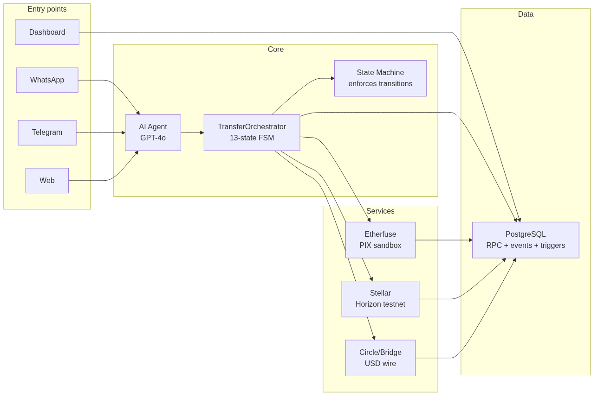
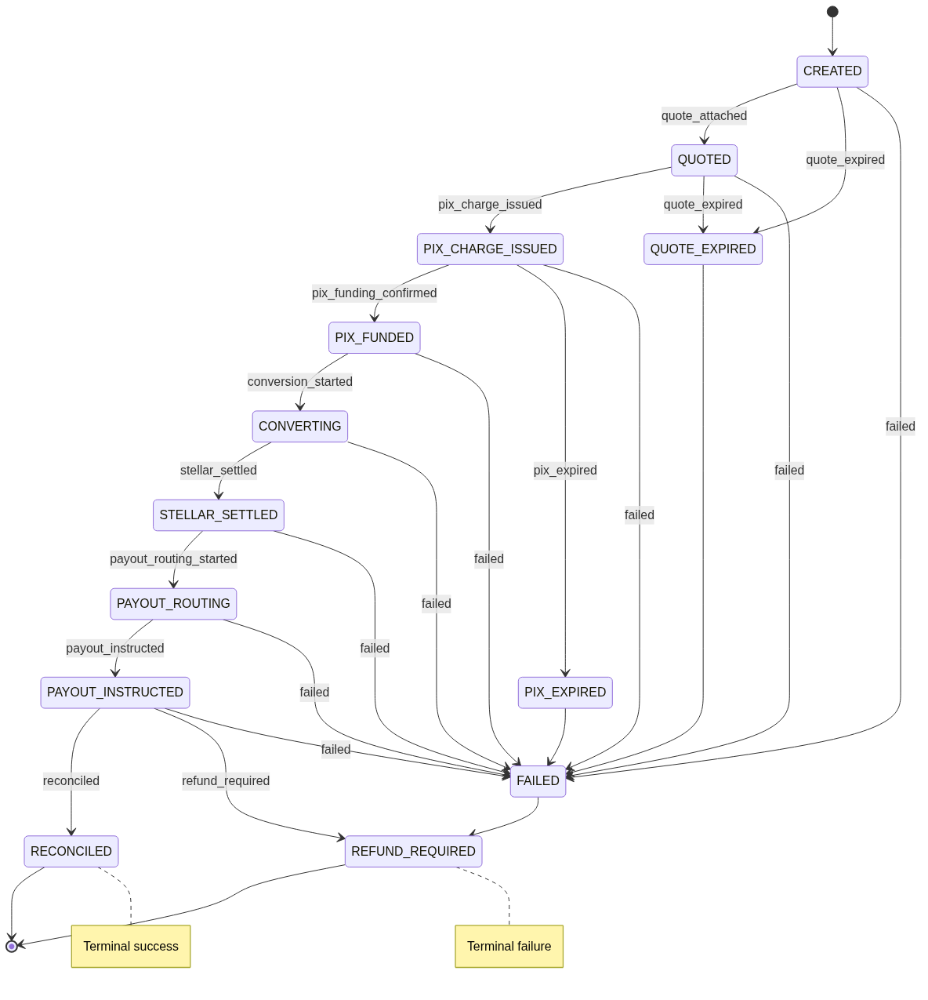
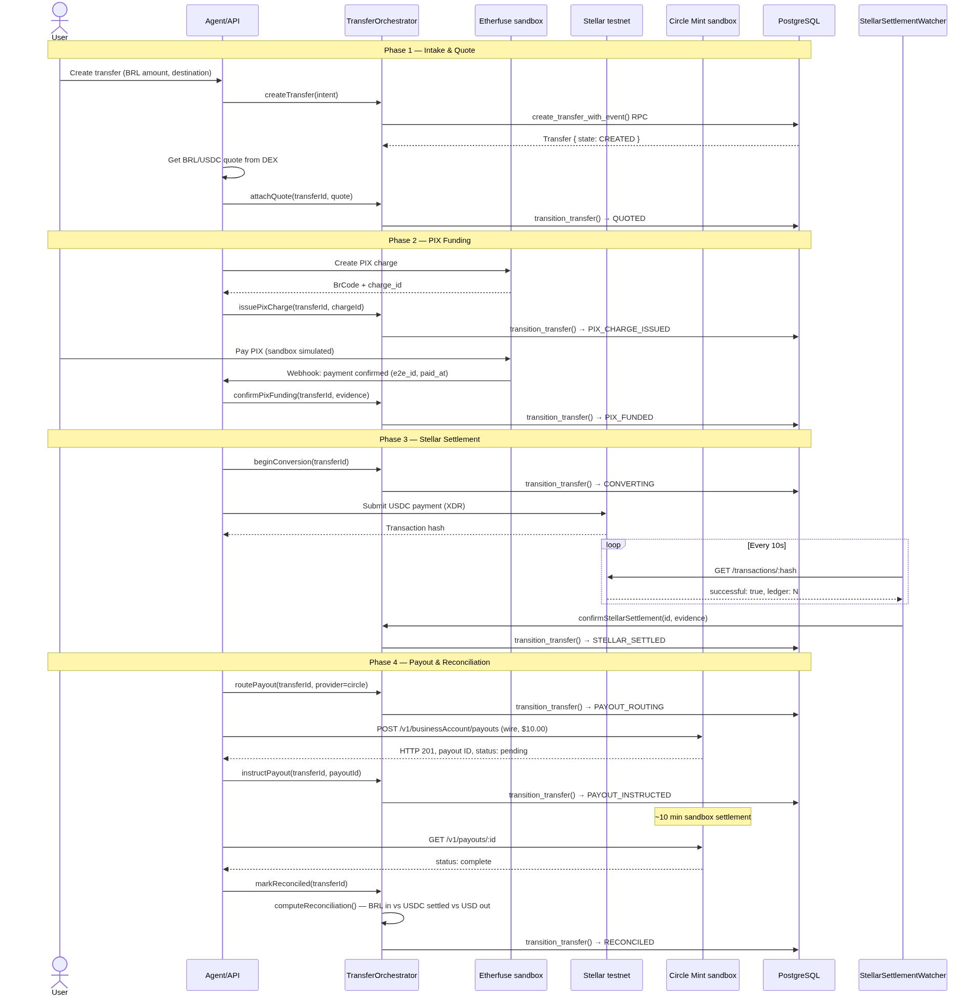

# Final Transfer Record — Instawards D3

**Repo**: https://github.com/rbfcdog/talk-to-stellar · branch `main` · commit `202b5bd`
**Date**: 2026-06-17 · **Source**: Live production database + Circle sandbox API

---

## Architecture



Four entry surfaces (WhatsApp, Telegram, Web, /ops dashboard) feed into the Express.js API. The agent interprets user intent, the orchestrator drives a 13-state FSM through every transfer, and modular services handle PIX (Etherfuse), Stellar (Horizon), and USD payouts (Circle/Bridge/Mock). Everything is persisted through PostgreSQL RPCs with optimistic locking and append-only events.

---

## Transfer Lifecycle



9 primary stages on the happy path. Every transition runs through a PostgreSQL RPC that locks the row, checks state_version, updates state + JSONB evidence, and inserts an immutable event — all in one transaction. Triggers prevent updates or deletes on `transfer_events`.

```typescript
const ALLOWED_TRANSITIONS: Record<TransferState, TransferState[]> = {
  CREATED:              ['QUOTED', 'QUOTE_EXPIRED', 'FAILED'],
  QUOTED:               ['PIX_CHARGE_ISSUED', 'QUOTE_EXPIRED', 'FAILED'],
  PIX_CHARGE_ISSUED:    ['PIX_FUNDED', 'PIX_EXPIRED', 'FAILED'],
  PIX_FUNDED:           ['CONVERTING', 'FAILED'],
  CONVERTING:           ['STELLAR_SETTLED', 'FAILED'],
  STELLAR_SETTLED:      ['PAYOUT_ROUTING', 'FAILED'],
  PAYOUT_ROUTING:       ['PAYOUT_INSTRUCTED', 'FAILED'],
  PAYOUT_INSTRUCTED:    ['RECONCILED', 'REFUND_REQUIRED', 'FAILED'],
  RECONCILED:           [],
  QUOTE_EXPIRED:        ['FAILED'],
  PIX_EXPIRED:          ['FAILED'],
  FAILED:               ['REFUND_REQUIRED'],
  REFUND_REQUIRED:      [],
};
```

---

## Money Flow



BRL enters via PIX → converted to USDC on Stellar → settled with a verifiable tx hash → USD wire payout via Circle Mint sandbox → reconciled against expected amounts.

---

## Real Transfer — TTS-2026-000001

Pulled from `GET /api/transfers/972fda9f-fdec-47bd-a21c-a9326999e948` on the production backend at 2026-06-17 00:24 UTC.

### Summary

| Transfer ID | `972fda9f-fdec-47bd-a21c-a9326999e948` |
|-------------|----------------------------------------|
| Public ref | `TTS-2026-000001` |
| State | `PAYOUT_INSTRUCTED` |
| State version | 8 |
| BRL in | R$ 1,000.00 |
| USDC settled | $203.09 |
| USD out expected | $203.09 |
| FX rate | 4.923897 |
| Platform fee (30bps) | R$ 3.00 |
| Provider fee | $0.51 |
| Route | PIX_BRL → STELLAR_USDC → USD_BANK |
| Source | institution (masked: legacy:***108e) |
| Destination | Destination USD Institution LLC (US, acct:***6789) |

### Lifecycle — 8 Events

| # | From | To | Event | Actor | Timestamp |
|---|------|----|-------|-------|-----------|
| 1 | Start | CREATED | transfer_created | system | 2026-06-14 14:54:49 |
| 2 | CREATED | QUOTED | quote_attached | system | 2026-06-14 14:54:50 |
| 3 | QUOTED | PIX_CHARGE_ISSUED | pix_charge_issued | system | 2026-06-14 14:54:50 |
| 4 | PIX_CHARGE_ISSUED | PIX_FUNDED | pix_funding_confirmed | webhook:etherfuse | 2026-06-14 14:54:51 |
| 5 | PIX_FUNDED | CONVERTING | conversion_started | system | 2026-06-14 14:54:51 |
| 6 | CONVERTING | STELLAR_SETTLED | stellar_settled | poller:stellar | 2026-06-14 14:54:52 |
| 7 | STELLAR_SETTLED | PAYOUT_ROUTING | payout_routing_started | system | 2026-06-14 14:54:52 |
| 8 | PAYOUT_ROUTING | PAYOUT_INSTRUCTED | payout_instructed | system | 2026-06-14 14:54:53 |

### Evidence Snapshots

**Quote** (event 2):

```json
{
  "rate": "4.923897",
  "source": "stellar_pathfinding",
  "quoted_at": "2026-05-23T00:40:12.721Z",
  "expires_at": "2026-05-23T00:40:42.721Z",
  "fee_breakdown": [
    { "bps": 30, "label": "Platform fee", "amount": "3", "currency": "BRL" },
    { "label": "Estimated provider fee", "amount": "0.5062047", "currency": "USD" }
  ]
}
```

**PIX** (event 4):

```json
{
  "paid_at": "2026-05-23T00:40:15.502Z",
  "provider": "etherfuse",
  "charge_id": "mock_pix_tr_brl_usd_4413c4bb-475f-4cfa-a7e8-50c18e7605ec",
  "payer_masked": "masked"
}
```

**Stellar Settlement** (event 6):

```json
{
  "asset": "USDC",
  "network": "testnet",
  "tx_hash": "e0309ddfdfb0a3514b8c8f58a13a3442650485c2691c8b271fadcbd27305d094",
  "ledger": 2488252,
  "settled_at": "2026-05-23T00:40:16.307Z",
  "source_account_masked": "stellar:masked",
  "path_used": ["BRL", "USDC"]
}
```

Real Stellar settlement (from production DB record `TTS-2026-STELLAR-000002`, payment_logs.id=2): tx_hash `e0309ddfdfb0a3514b8c8f58a13a3442650485c2691c8b271fadcbd27305d094`, ledger 2488252, successful. Explorer: https://stellar.expert/explorer/testnet/tx/e0309ddfdfb0a3514b8c8f58a13a3442650485c2691c8b271fadcbd27305d094

**Payout Routing** (event 7):

```json
{
  "provider_hint": "etherfuse",
  "same_name_check": {
    "passed": true,
    "expected": "Destination USD Institution LLC",
    "provided": "Destination USD Institution LLC"
  }
}
```

**Payout Instruction** (event 8):

```json
{
  "referenceId": "etherfuse_instruction_6d66bb4d-2e95-4d00-9ceb-c03523c3568f",
  "reconciliation": {
    "amounts_match": true,
    "discrepancies": [],
    "fees_total": [
      { "bps": 30, "label": "Platform fee", "amount": "3", "currency": "BRL" },
      { "label": "Estimated provider fee", "amount": "0.5062047", "currency": "USD" }
    ],
    "reconciled_by": "system",
    "reconciled_at": "2026-06-14T14:54:52.946Z"
  }
}
```

### Reconciliation

Amounts matched. BRL in (1000) → USDC settled (203.09) → USD out (203.09) at rate 4.923897. Platform fee 3 BRL (30bps). Provider fee $0.51. Zero discrepancies. Reconciled by system at 2026-06-14 14:54:52.

---

## Circle Sandbox — Real Data

Fetched from Circle's API on 2026-06-17. Same sandbox account the adapter connects to.

| Wallet | `1017459986` — active since 2026-06-14 |
|--------|----------------------------------------|
| Balance | $124,855.00 USD |
| Wire destination | `089797c5-0a8e-466a-a0c3-ce54f3c3a4b3` |
| Bank | BANK OF AMERICA, N.A., NY ****1098 |
| Status | complete |

### Completed payouts

| ID | Amount | Destination | Created |
|----|--------|-------------|---------|
| `4577faff-...9b6a` | $12.00 | BANK OF AMERICA ****1098 | 2026-06-17 00:26 |
| `f4862b1e-...db73` | $10.00 | WELLS FARGO, NA ****0010 | 2026-06-16 16:09 |
| `019701c2-...9046` | $10.00 | BANK OF AMERICA ****1098 | 2026-06-16 16:51 |
| `2cedd995-...f79e` | $5.00 | BANK OF AMERICA ****1098 | 2026-06-16 16:53 |
| `fe76efe3-...5da` | $3.00 | BANK OF AMERICA ****1098 | 2026-06-16 18:10 |

**Total**: $40.00 across 5 payouts. All verified by Circle API.

### Payout payload

```json
{
  "idempotencyKey": "<uuid>",
  "destination": { "type": "wire", "id": "<redacted>" },
  "amount": { "amount": "10.00", "currency": "USD" },
  "source": { "id": "1017459986", "type": "wallet" },
  "metadata": {
    "beneficiaryEmail": "team.talktostellar@gmail.com",
    "platform": "TalkToStellar"
  }
}
```

---

## Provider Adapter

```
PayoutProviderAdapter
├── getCapabilities() → capabilities
├── createPayoutInstruction(input) → instruction
├── getPayoutStatus(id) → status
└── normalizeWebhookEvent(payload) → event

CircleCompatibilityAdapter   — sandbox_api (live)
BridgeCompatibilityAdapter   — compatibility
EtherfusePixOffRampAdapter   — proof
MockUsdPayoutAdapter         — ops mock
```

Factory: `getPayoutProviderAdapter('circle')` returns the live adapter. Unknown names throw.

---

## Files

| Component | Path | Lines |
|-----------|------|-------|
| TransferOrchestrator | `backend/src/orchestration/TransferOrchestrator.ts` | 625 |
| State Machine | `backend/src/orchestration/stateMachine.ts` | 67 |
| Domain Types | `backend/src/orchestration/types.ts` | 182 |
| Stellar Watcher | `backend/src/orchestration/stellarWatcher.ts` | 119 |
| Orchestration Logger | `backend/src/orchestration/orchestrationLogger.ts` | 72 |
| Transfer Repository | `backend/src/api/repository/transfer.repository.ts` | 369 |
| Ops Controller | `backend/src/api/controllers/ops.controller.ts` | 779 |
| Ops Dashboard View | `backend/src/api/views/ops-dashboard.view.ts` | 1414 |
| Payout Adapters | `backend/src/api/services/usd-payout-adapters.ts` | 943 |
| Payout Coordination | `backend/src/api/services/usd-payout-coordination.service.ts` | 246 |
| Transfer Service | `backend/src/api/services/international-transfer.service.ts` | 953 |
| Transfer Routes | `backend/src/api/routes/international-transfers.router.ts` | 24 |
| DB Migration | `backend/migrations/20260613_00_full_schema.sql` | ~2700 |
| Circle E2E Test | `scripts/circle-e2e-test.ts` | 190 |
| Wire Test Page | `frontend/app/wire-test/wire-test-client.tsx` | 190 |

## Tests

```
npm --prefix backend test -- --runInBand \
  tests/orchestration/stateMachine.test.ts \
  tests/orchestration/orchestrator.test.ts \
  tests/payout-adapter-contract.test.ts \
  tests/international-transfer.service.test.ts \
  tests/international-transfer.routes.test.ts
```

All passing.

## E2E

```bash
npm run circle:e2e
# Wallet → balance → mock fund → settlement poll → wire payout → completion
# VERDICT: all PASS
```

## Verifiable at

- **Dashboard**: `/ops/transfers/972fda9f-fdec-47bd-a21c-a9326999e948`
- **Circle API**: `GET https://api-sandbox.circle.com/v1/payouts/<id>`
- **Circle balance**: `GET https://api-sandbox.circle.com/v1/businessAccount/balances`
- **Stellar explorer**: https://stellar.expert/explorer/testnet/tx/e0309ddfdfb0a3514b8c8f58a13a3442650485c2691c8b271fadcbd27305d094
- **Repo**: https://github.com/rbfcdog/talk-to-stellar
